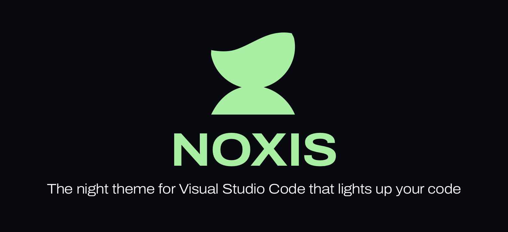
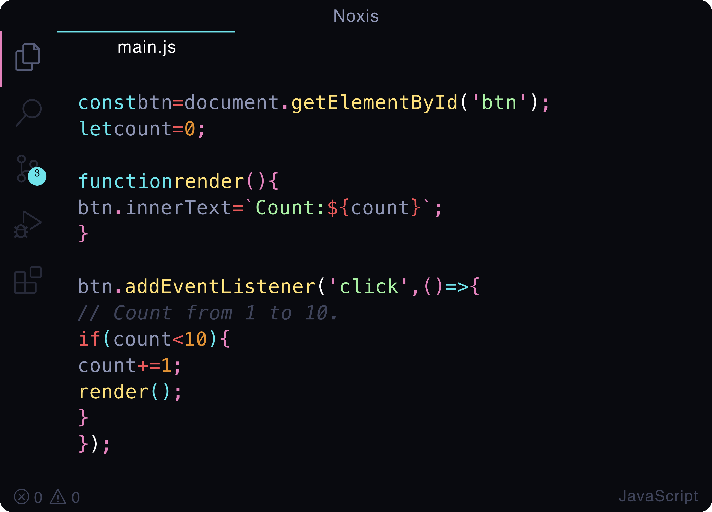

The night theme for Visual Studio Code that lights up your code.

---

* [Getting started](#getting-started)
  * [Installation](#installation)
    * [Visual Studio Code Marketplace](#visual-studio-code-marketplace)
    * [Manual](#manual)
  * [Activate theme](#activate-theme)
* [Override theme colors](#override-theme-colors)
  * [Color Scheme override](#color-scheme-override)
* [Recommended settings for a better experience](#recommended-settings-for-a-better-experience)
* [Create/Renew Visual Studio Code Marketplace token](#createrenew-visual-studio-code-marketplace-token)
* [Visual Studio Code resources](#visual-studio-code-resources)
* [Attribution and license](#attribution-and-license)

</br>



</br>

## Getting started

### Installation

#### Visual Studio Code Marketplace

The simplest way to install this theme is through the [Visual Studio Code Marketplace](https://marketplace.visualstudio.com/items?itemName=valentinocossar.noxis). Click the link and follow the installation instructions provided.

#### Manual

For those who prefer manual installation, follow these steps:

1. Run the following commands in your terminal:

    ```sh
    npm ci
    npm run build
    ```

2. Install the theme package in Visual Studio Code:

    ```sh
    code --install-extension noxis-<version>.vsix
    ```

### Activate theme

Launch _Quick Open_:

* Linux `Ctrl + Shift + P`
* macOS `⌘ + Shift + P`
* Windows `Ctrl + Shift + P`

Type `theme`, choose `Preferences: Color Theme`, and select `Noxis` from the list.

## Override theme colors

You can override the theme UI and schemes colors by adding these theme-specific settings to your configuration. For advanced customisation please check the [relative section on the VS Code documentation](https://code.visualstudio.com/docs/getstarted/themes#_customizing-a-color-theme).

### Color Scheme override

#### Basic example

```json
"editor.tokenColorCustomizations": {
    "[Noxis]": {
        "comments": "#229977"
    }
},
```

#### Advanced example

```json
"editor.tokenColorCustomizations": {
  "[Noxis]": {
    "textMateRules": [
      {
        "scope": [
          "punctuation.definition.comment",
          "comment.block",
          "comment.line",
          "comment.block.documentation"
        ],
        "settings": {
          "foreground": "#FF0000"
        }
      }
    ]
  },
},

"workbench.colorCustomizations": {
  "[Noxis]": {
    "sideBar.background": "#ff0000",
  }
},
```

## Recommended settings for a better experience

```js
{
  // Controls the font family. You need Operator Mono Font
  "editor.fontFamily": "Operator Mono Lig",
  // Controls the line height. Use 0 to compute the lineHeight from the fontSize.
  "editor.lineHeight": 30,
  // Enables font ligatures
  "editor.fontLigatures": true,
  // Controls if file decorations should use badges.
  "explorer.decorations.badges": true,
  // Disable GIT colors for files
  "explorer.decorations.colors": false
}
```

## Create/Renew Visual Studio Code Marketplace token

1. Go to [Azure DevOps](https://dev.azure.com/) and create an organization if at least one does not already exist (creating a project is not required).
2. Navigate to `User Settings` → `Personal Access Tokens` (e.g., `https://dev.azure.com/<username>/_usersSettings/tokens`).
3. Set the `Access Scope` to `All accessible organizations`.
4. Create or renew the required token and use its value as the `VS_MARKETPLACE_TOKEN` GitHub secret for this repository.

The Azure DevOps PAT (Personal Access Token) should be `Custom defined` and include all the scopes for the `Marketplace` (read, acquire, publish, and manage). Name the token as you prefer, for example, `Visual Studio Code Extension Release`.

## Visual Studio Code resources

Some useful links from the Visual Studio Code documentation to help you build and update a theme:

* [**Creating a color theme**](https://code.visualstudio.com/api/extension-guides/color-theme) - Learn how to create a custom color theme for Visual Studio Code.
* [**Theme color reference**](https://code.visualstudio.com/api/references/theme-color) - A comprehensive list of themeable colors in Visual Studio Code.
* [**TextMate grammar**](https://code.visualstudio.com/api/language-extensions/syntax-highlight-guide) - Understand how syntax highlighting works using TextMate grammars.
* [**Publishing extensions**](https://code.visualstudio.com/api/working-with-extensions/publishing-extension) - A guide to publishing a theme or extension to the Visual Studio Code Marketplace.
* [**Extension manifest**](https://code.visualstudio.com/api/references/extension-manifest) - Learn about the `package.json` file and how to configure an extension.
* [**Testing the theme**](https://code.visualstudio.com/api/extension-guides/color-theme#testing-the-theme) - Tips and tools for testing a theme to ensure it works as expected.

## Attribution and license

[](https://opensource.org/licenses/Apache-2.0)

This project is a fork of the original repository by Mattia Astorino.
Significant modifications have been made by me (Valentino Cossar) under the Apache License 2.0.
